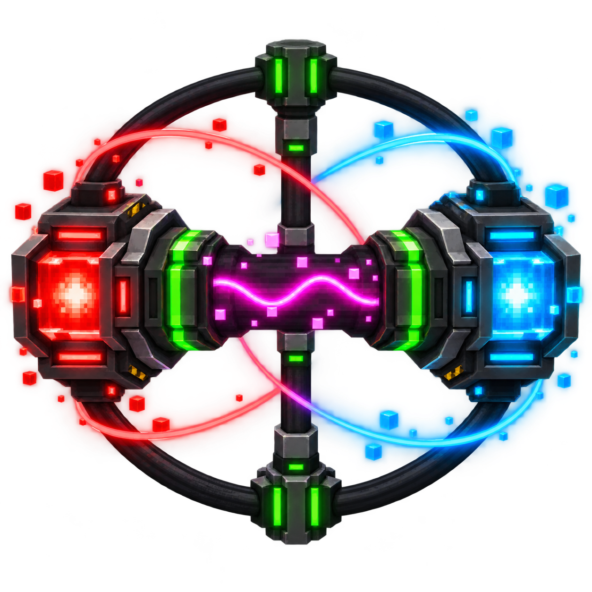
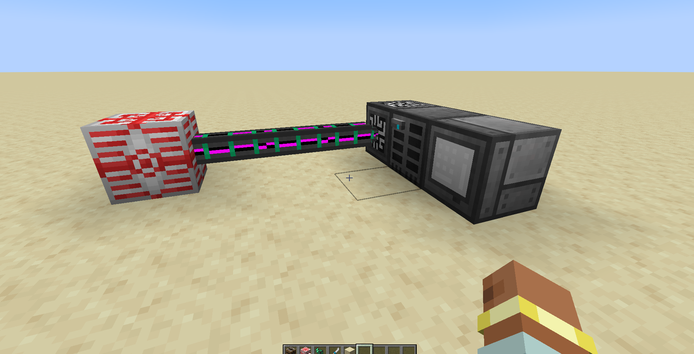

<p align="center">
  
</p>

# IC2 Universal Energy Extension

**IC2 Universal Energy Extension** is a Forge 1.20.1 addon that connects IndustrialCraft 2 EU networks to Forge Energy machines through full-featured Universal Cables. The project started as `ic2-bridge-fuel-bc2`, a focused IC2/BuildCraft fuel and energy bridge, and grew into a broader energy-integration addon with selected Mekanism transmitter systems and the Configurator.

## 1.0.1 crash fix

Restores registration of the original Mekanism `PacketKey` client-to-server message. In 1.0.0, pressing the Boost key (Left Ctrl by default, also used for sprinting) in a world could crash the client with `IllegalArgumentException: Invalid message mekanism.common.network.to_server.PacketKey`. Existing packet IDs are preserved. Update both client and server to 1.0.1 when playing multiplayer.

The `PacketKeyRegistrationTest` GameTest exercises the initialized Forge channel encoder for key presses and releases. Run it with the existing energy bridge tests using `gradlew.bat runGameTestServer`; build the primary distributable with `gradlew.bat jar reobfJar`.

## 1.0.2 integration fixes

The MJ receiving bridge snapshots demand on the server thread and queues worker-thread EU injections for server-thread delivery. Multiple inputs share one per-endpoint transfer budget. Known BuildCraft fuel profiles now read energy densities from the installed fuel registry instead of assuming every CE release uses the same recipes. Fuel registration waits for the world's server configuration. Removed FE receivers are detached from the EnergyNet.

Forestry now uses only `IC2 EU -> Universal Cable -> Forestry FE`, without a separate Forestry adapter or configuration toggle. The original Mekanism cable network is unchanged. The 1.0.1 packet crash fix is included.

Run the optional, local-mod integration suite on drive R: with `scripts/test-integrations.ps1 -BuildJar`. It uses Java 17 and the supplied `R:\Codex-misc\Mods` directory, runs GameTests, builds/reobfuscates the primary JAR, and audits it for test classes, embedded mods, Java version and MIT attribution. Test code and fixtures are kept outside the production source set.

Validation: 20/20 integration GameTests and 6/6 base GameTests without BuildCraft/Forestry. See the [test report and verification limits](docs/integration-test-report-1.0.2.md).

## 1.0.3 persistence and GUI fixes

The Universal Cable's Forge Energy compatibility wrapper now marks the receiving or supplying machine's loaded chunk for saving after a real, nonzero transfer. This fixes stale stored-energy values after world reloads with block-entity-backed FE implementations such as Forestry. Refined Storage keeps controller energy in separate world SavedData, so an optional public-API notification also marks that network data for saving. Simulations, rejected transfers and removed owners do not trigger saves. Distribution, capability routing and conversion ratios are unchanged; there are no machine-specific energy adapters.

Resource packaging explicitly uses UTF-8, preserving arrows, status symbols and translated text on Windows. The config screen uses the current mod name, responsive input columns, labels anchored to their fields, a compact Energy page and green save confirmations. Unsaved field values survive resizing.

The release audit also compares all EN/PL translations against their UTF-8 sources and rejects persistence-test classes in the primary JAR. See [1.0.3 changes](CHANGELOG.md) and [test results](docs/integration-test-report-1.0.3.md).

## In game



*An IC2 MFSU powering a Refined Storage controller through a Universal Cable network. Energy enters the cable as EU, is converted at the boundary, and is transported as FE.*

## What it provides

- Universal Cables in Basic, Advanced, Elite, and Ultimate tiers.
- Mechanical Pipes, Pressurized Tubes, Logistical Transporters, Restrictive and Diversion Transporters, and Thermodynamic Conductors with their original tiers and behavior.
- Mekanism-derived transmitter networking, side configuration, NBT, packets, rendering, textures, models, overlays, and Configurator behavior.
- IC2 EU to Forge Energy conversion for receiving `IEnergyStorage` implementations, including Refined Storage and other FE machines.
- Demand-aware EU intake: when downstream FE consumers stop accepting energy, the cable endpoint stops requesting EU instead of voiding it.
- IC2 EU ↔ BuildCraft MJ conversion.
- BuildCraft fuel ↔ IC2 Semifluid Generator integration.
- Forestry FE support through the original Universal Cable network; no separate Forestry energy adapter.
- Crafting recipes based on IC2 materials.
- English and Polish configuration UI.

## EU through Universal Cables

Use this topology:

```text
IC2 generator/storage -> IC2 cable -> Universal Cable network -> FE machine
```

Each receiving Universal Cable endpoint is exposed to IC2's EnergyNet as a sink. Accepted EU is converted at the boundary by the shared `EnergyConversionService`, then inserted through the cable's Forge Energy capability. The cable network therefore carries FE and retains the original tier limits, routing, rendering, and transfer behavior.

The bridge applies downstream demand and backpressure before requesting EU. A full or missing FE consumer closes the input, while queued converted energy remains accounted for rather than disappearing. Direct IC2-cable-to-FE-machine connections remain supported for other FE consumers; Forestry intentionally requires a Universal Cable.

Refined Storage energy transfer is capability-based. Any machine exposing a receiving `ForgeCapabilities.ENERGY` endpoint can use the same path. No Refined Storage classes are bundled and no implementation classes are linked; the optional public API is used only to notify its separate network SavedData after cable transfers.

## Energy integrations

### IC2 → BuildCraft MJ

The bridge discovers BuildCraft's public `IMjReceiver` capability and exposes each receiver block entity to the IC2 EnergyNet as a sink. Connect an IC2 cable or emitter directly to a compatible BuildCraft endpoint; accepted EU is converted to micro-MJ and inserted into the receiver. This is capability-based rather than hardcoded for individual machines, so it covers endpoints such as the Quarry, Mining Well, Builder, Filler, Distiller, Chute, Laser, and compatible engines.

The known BuildCraft endpoints are also included in IC2's `forge:cable_connectable` tag so IC2 cable arms visually meet the machine face. In `AUTO` mode the bridge follows the receiver's request; `MANUAL` mode applies the configured per-endpoint EU/t limit.

### BuildCraft MJ → IC2

BuildCraft blocks exposing `IMjPassiveProvider` are registered as IC2 EnergyNet sources. Their offered micro-MJ is converted to EU and delivered through the normal IC2 grid, preserving IC2 cable voltage, tier, and transformer rules. Both BuildCraft energy directions can be enabled independently.

BuildCraft CE 8.0.13 engines push MJ and do not expose this passive-provider capability. Do not interpret the reverse bridge as support for directly connecting those engines to a BatBox. This API limitation does not affect IC2 generators or BatBoxes powering a Quarry.

### Forestry through Universal Cables

Connect an IC2 source to a Universal Cable and connect the cable to Forestry's FE input. The cable's existing IC2 adapter converts EU through its original Forge Energy capability; the unmodified Mekanism network distributes FE to Forestry. Forestry machines are not registered as separate IC2 endpoints. There is no dedicated Forestry-to-IC2 adapter or toggle.

### BuildCraft transport pipes ↔ IC2 machines

BuildCraft transport uses Forge capabilities that IC2 1.20.1 exposes directly:

- fluid pipes use `ForgeCapabilities.FLUID_HANDLER` to fill and drain IC2 tanks and fluid machines from valid sides;
- item pipes use `ForgeCapabilities.ITEM_HANDLER` and retain IC2's slot-side rules;
- power pipes are handled when their endpoint exposes an `IMjReceiver`;
- structure pipes do not transport items, fluids, or energy and therefore require no bridge.

## Fuel integrations

### BuildCraft fuels → IC2

BuildCraft CE combustion fluids are registered as IC2 Semifluid Generator fuels. Known CE fuels retain their individual BuildCraft energy densities and have configurable per-fuel `AUTO`/`MANUAL` profiles. The addon also provides filled IC2-style cells for the standard oil and fuel variants.

Automatic discovery can register additional oil/fuel fluids by registry namespace and path. Pack authors can change the namespace filters, generic oil and fuel energy values, cycle sizes, the global energy multiplier, or supply exact rules for any fluid.

### IC2 fuels → BuildCraft

Accepted IC2 Semifluid Generator fuels can be imported into BuildCraft's combustion-fuel registry. Automatic discovery defaults to the `ic2` namespace, making fuels such as IC2 biogas available to compatible BuildCraft combustion engines. Namespace filters, burn time, automatic discovery, and exact per-fluid overrides are configurable.

The two fuel directions are independent. If one BuildCraft API feature is unavailable, the remaining energy, fuel, and fluid integrations stay enabled whenever their required capabilities are present. `BuildCraftCompatibilityResolver` probes the installed public APIs and registries instead of rejecting an unfamiliar BuildCraft version solely by its version string; the in-game **Compatibility** page reports every detected feature.

## Conversion configuration

The server configuration is stored per world at:

```text
<world>/serverconfig/ic2universalenergy-server.toml
```

`forgeEnergyPerEu` means **how many FE one EU produces**. Its default is `4.0`:

| Value | Result |
| ---: | :--- |
| `0.2` | 5 EU produces 1 FE |
| `4.0` | 1 EU produces 4 FE |
| `20.0` | 1 EU produces 20 FE |

A higher value therefore consumes less EU for the same FE demand. BuildCraft uses the existing automatic `2.5 EU/MJ` ratio unless manual conversion is selected. Transfer limits and fuel-bridge settings are available from the Forge Mods configuration screen.

`EnergyConversionService` is the single conversion authority shared by the live BuildCraft energy bridges and both fuel-registration directions:

```text
AUTO   2.5 EU / MJ
MANUAL configured manualEuPerBuildCraftMj
```

The most important server-config sections are:

```toml
[energy]
    ic2ToBuildCraftEnabled = true
    buildCraftToIc2Enabled = true
    ic2ToForgeEnergyEnabled = true
    forgeEnergyPerEu = 4.0
    conversionMode = "AUTO"
    manualEuPerBuildCraftMj = 2.5
    transferLimitMode = "AUTO"
    manualTransferLimitEuPerTick = 128.0

[fuels.buildCraftToIc2]
    enabled = true

[fuels.ic2ToBuildCraft]
    enabled = true
    autoDiscovery = true
    namespaceTokens = ["ic2"]
    burnTimeTicks = 10
```

Exact BuildCraft → IC2 fuel rules use:

```text
namespace:path;energyEuPerReferenceUnit;referenceUnitVolumeMb;cycleAmountMb
```

Exact IC2 → BuildCraft rules use:

```text
namespace:path;energyEuPerMb;burnTimeTicks
```

Exact rules take priority over automatic discovery. Restart the server after changing fuel registration because IC2 and BuildCraft fuel registry entries cannot be replaced safely while a world is running.

### Configuration screens

| Energy | BuildCraft → IC2 |
| --- | --- |
| [](docs/screenshots/01-energy.png) | [](docs/screenshots/02-bc-to-ic2.png) |
| Fuel profiles | IC2 → BuildCraft |
| [](docs/screenshots/03-fuel-profiles.png) | [](docs/screenshots/04-ic2-to-bc.png) |
| Balance | Overrides |
| [](docs/screenshots/05-balance.png) | [](docs/screenshots/06-overrides.png) |
| Discovery | Compatibility |
| [](docs/screenshots/07-discovery.png) | [](docs/screenshots/08-compatibility.png) |

### Fuel bridge in game

[](docs/screenshots/09-semifluid-generator.png)

## Requirements and compatibility

- Minecraft 1.20.1
- Forge 47.4.23 or a compatible Forge 47 build
- IndustrialCraft 2: Refactored `2.10.33-ex120`
- BuildCraft, Forestry, and Refined Storage are optional integrations

This is a **Forge** mod, not a NeoForge mod.

Remove the old standalone `bcic2fuelbridge` and `transporter` JARs before installing the combined addon. The resulting JAR owns the extracted `mekanism.*` transmitter classes, so it must not be installed alongside full Mekanism 10.4.x.

## Build

Use Java 17 and keep Gradle data on drive R:, for example:

```powershell
$env:GRADLE_USER_HOME = 'R:\Codex-misc\ic2 mods\ic2-bridge-fuel-bc2\.gradle-user-home'
.\gradlew.bat build --no-daemon
```

The primary artifact is named `IC2-Universal-Energy-Extension-1.20.1-<version>.jar`.

## History, source, and license

This repository began as [DasIstEin20/ic2-bridge-fuel-bc2](https://github.com/DasIstEin20/ic2-bridge-fuel-bc2), which bridged IC2 with BuildCraft fuels and energy. It has since evolved into IC2 Universal Energy Extension: a single addon combining those bridges with EU/FE conversion and cable-based distribution.

Selected transmitter and Configurator code, rendering logic, models, textures, and related assets are copied or adapted from Mekanism 10.4.16 in accordance with its MIT License. The original Mekanism copyright notice is retained in this project's `LICENSE`.

- [Mekanism on CurseForge](https://www.curseforge.com/minecraft/mc-mods/mekanism)
- [Mekanism source code](https://github.com/mekanism/Mekanism)

This project is distributed under the MIT License. See [`LICENSE`](LICENSE) for the complete notices and terms.
