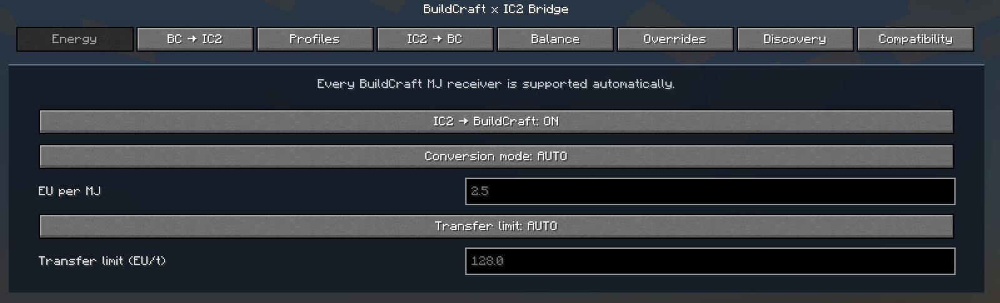
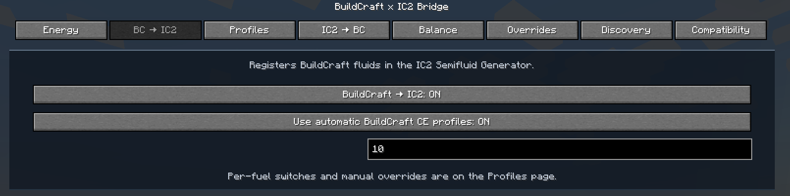
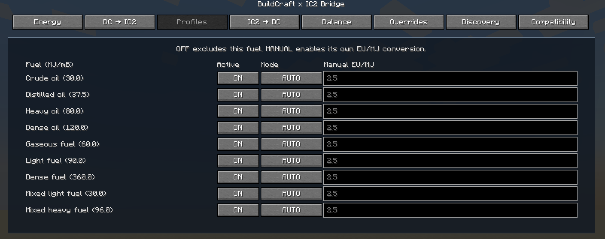
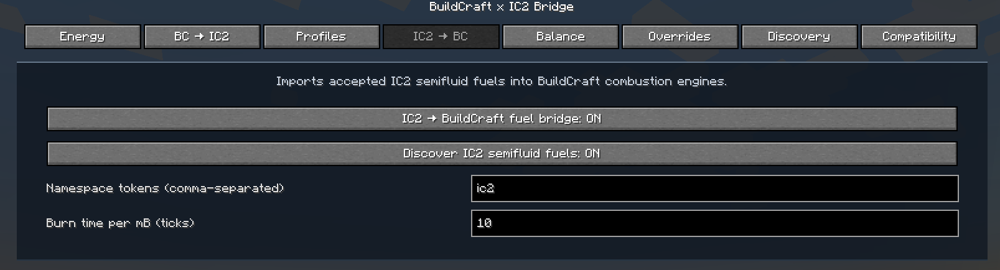
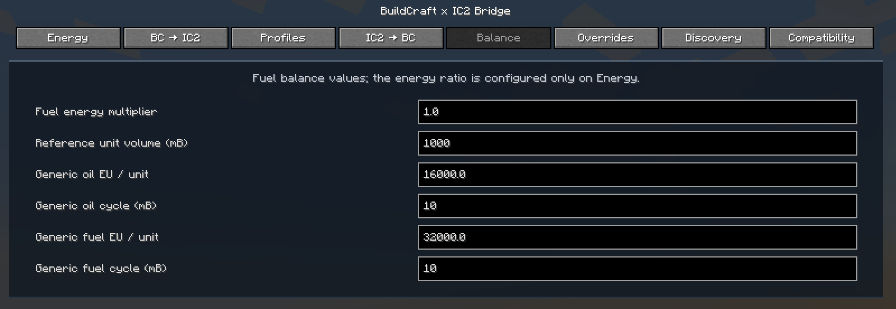
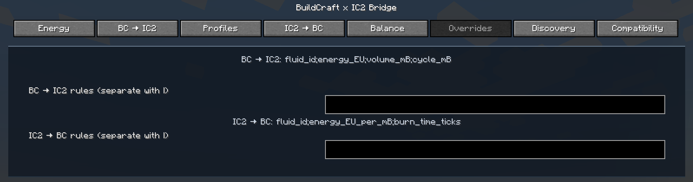
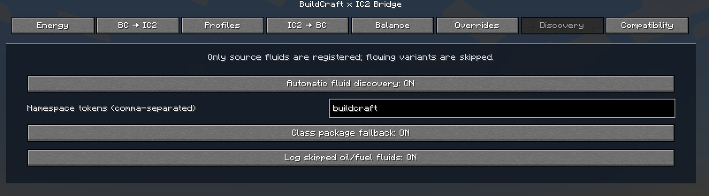
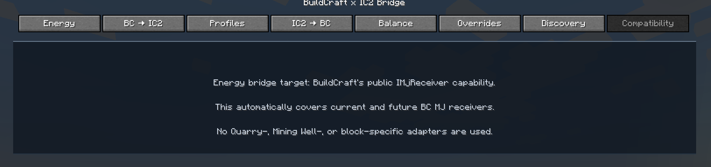
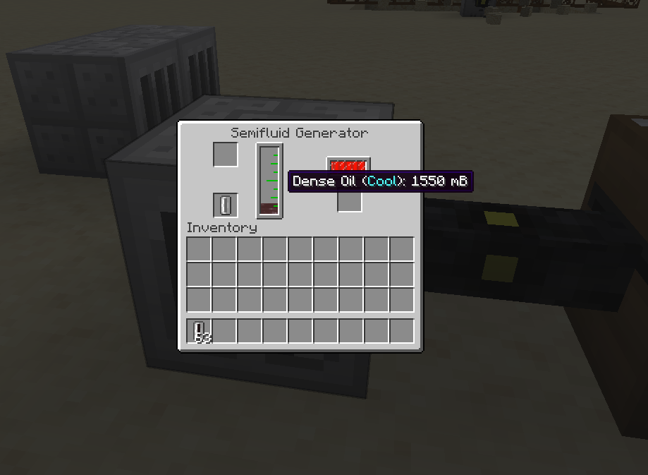

# BuildCraft x IC2 Bridge

Compatibility layer for BuildCraft Community Edition and IC2 on Minecraft Forge 1.20.1. The repository name remains `ic2-bridge-fuel-bc2` for continuity, but the in-game name is **BuildCraft x IC2 Bridge**.

## BuildCraft compatibility (0.2.2)

BuildCraft is optional and has no hard minimum version in `mods.toml`. The bridge does not stop Forge from loading just because a BuildCraft fork reports an older, newer, or unfamiliar version.

At runtime `BuildCraftCompatibilityResolver` probes public API features first: the `IMjReceiver` capability, a usable combustion-fuel registry, and BuildCraft fluids in Forge's registry. A version string is diagnostic only. The resolver labels verified CE 8.x and CE 7.99.x APIs when their features are present; an unfamiliar release receives the **Generic / BEST_EFFORT** reflection and registry fallback.

Energy, BuildCraft → IC2 fuels, IC2 → BuildCraft fuels, and fluid discovery are independent capabilities. If one API is absent, the other working capabilities remain enabled and Forge startup continues. The in-game **Compatibility** page reports the selected BuildCraft module ID and version, adapter, mode, and the status of every capability.

## Modules

### Energy Bridge — IC2 → BuildCraft

The bridge discovers BuildCraft's public `IMjReceiver` capability and registers an IC2 EnergyNet sink for each receiver block entity. It therefore covers every current and future BuildCraft MJ consumer through the same integration point; there are no Quarry-, Mining Well-, or machine-specific adapters.

Connect an IC2 cable/emitter directly to a BuildCraft block that receives MJ. The bridge accepts EU from IC2 and inserts the corresponding micro-MJ into the receiver. The transfer is global ON/OFF and can either honor the receiver's own request (`AUTO`) or apply a per-receiver EU/t cap (`MANUAL`).

The bridge also contributes BuildCraft CE's common MJ receiver blocks to IC2's `forge:cable_connectable` tag. This is a client-visible compatibility detail: IC2 cable arms now extend flush to the machine face instead of visually stopping short. It includes Quarry, Builder, Filler, Mining Well, Distiller, Chute, and Laser; the actual power bridge still discovers any `IMjReceiver` dynamically.

### Fuel Bridge — BuildCraft → IC2

BuildCraft CE combustion fluids are registered as IC2 Semifluid Generator fuels with their individual BuildCraft energy densities. The bridge also supplies filled IC2 cells for the standard CE fluids.

### Fuel Bridge — IC2 → BuildCraft

Accepted IC2 Semifluid Generator fuels are imported into BuildCraft's shared combustion-fuel registry. By default only `ic2` namespace fluids are imported, which currently makes IC2 biogas available to BuildCraft combustion engines. The automatic source, namespace filters, burn time, and exact overrides are configurable.

## One conversion authority

`EnergyConversionService` is the only EU ↔ MJ conversion layer. The Energy Bridge and both fuel directions use it, so one ratio governs the whole mod:

```text
AUTO   2.5 EU / MJ
MANUAL configured manualEuPerBuildCraftMj
```

`AUTO` deliberately has a visible, stable default. Switch to `MANUAL` for a pack-specific ratio; the setting affects subsequent fuel registration after a restart as well as live energy transfers.

## Configuration and UI

All settings are Forge **server config** values:

```text
<world>/serverconfig/bcic2fuelbridge-server.toml
```

In an integrated server, open **Mods → BuildCraft x IC2 Bridge → Config**. On a dedicated server the synchronized screen is read-only; edit `serverconfig` as an administrator. The screen has categories for Energy, both fuel directions, individual profiles, Balance, Overrides, Discovery, and Compatibility.

English (`en_us`) and Polish (`pl_pl`) category/title translations are shipped. The Energy fields include tooltips explaining AUTO/MANUAL behavior.

Important server-config sections:

```toml
[energy]
    ic2ToBuildCraftEnabled = true
    conversionMode = "AUTO"
    manualEuPerBuildCraftMj = 2.5
    transferLimitMode = "AUTO"
    manualTransferLimitEuPerTick = 128.0

[fuels.buildCraftToIc2]
    enabled = true

[fuels.ic2ToBuildCraft]
    enabled = true
    autoDiscovery = true
    namespaceTokens = ["ic2"]
    burnTimeTicks = 10
```

### Exact fuel overrides

`fuels.buildCraftToIc2.overrides.customFuelRules` uses:

```text
fluid_id;energy_EU;reference_volume_mB;cycle_mB
```

`fuels.ic2ToBuildCraft.customFuelRules` uses:

```text
fluid_id;energy_EU_per_mB;burn_time_ticks
```

Exact rules take priority over automatic discovery. Restart the server after changing either fuel direction because existing IC2/BuildCraft fuel registry entries cannot safely be replaced while a world is running.

## Screenshots

### Configuration screen

| Energy | BuildCraft → IC2 |
| --- | --- |
| [](docs/screenshots/01-energy.png) | [](docs/screenshots/02-bc-to-ic2.png) |
| Fuel profiles | IC2 → BuildCraft |
| [](docs/screenshots/03-fuel-profiles.png) | [](docs/screenshots/04-ic2-to-bc.png) |
| Balance | Overrides |
| [](docs/screenshots/05-balance.png) | [](docs/screenshots/06-overrides.png) |
| Discovery | Compatibility |
| [](docs/screenshots/07-discovery.png) | [](docs/screenshots/08-compatibility.png) |

### In-game fuel bridge

[](docs/screenshots/09-semifluid-generator.png)

## Requirements

- Minecraft 1.20.1
- Forge 47.x
- IC2 for Forge 1.20.1
- BuildCraft is optional; BuildCraft CE 7.99.25.0 and CE 8.x are recognized when their public APIs are present. Other releases are attempted in BEST_EFFORT mode.

## Build

```text
gradlew.bat build
```

## License

MIT — see [LICENSE](LICENSE).
